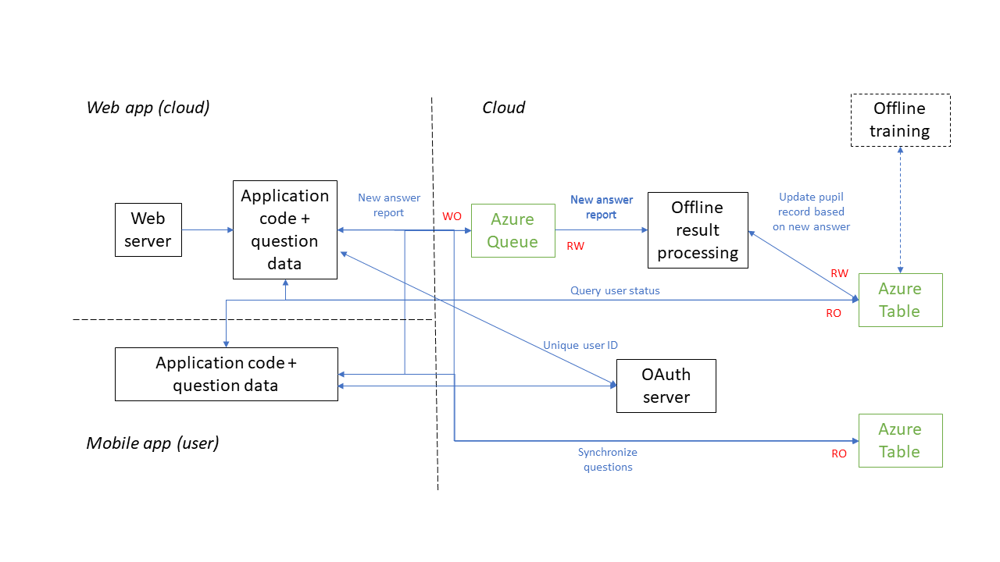

# Data design

## Question data

There are two types of question data that are static and do not depend on the way we choose to serve questions to pupils. The first type are the questions themselves, and the second type are the strings used to define the questions and/or answers (for textual answers), that can be in different languages. We use the following formats:

```
question: {unique_question_ID, version_ID, question_code}
strings: {unique_string_ID, version_ID, language, string value}
```

We envisage that the questions and strings tables will be rarely modified, and occasionally augmented with new questions and string translations in new languages. We also add version_ID field that specifies the application version the question has been tested with, which allows us to migrate questions to new application code if required.

In addition to this, different deployments of the system can structure questions in different ways using extra relationships. For example, one deployment tuned for a particular country or an educational system may decide to structure questions in different year groups and different teaching units within each year group. Then one may define the following additional tables:

```
year_group: {unique_year_group_ID, year_group_description}
teaching_unit: {unique_teaching_unit_ID, teaching_unit_description}
unit_questions: { unique_teaching_unit_ID, unique_question_ID}
```

This is just an example and one can create a customized deployment of the web site/app by tweaking the design of these tables but without modifying the questions and strings tables.

Question data necessarily requires at least two main tables (questions and strings) and a relation within them. It also requires some extra relations for question taxonomy. As such, it may require multiple lookups per question and is more amenable to SQL storage. However, as this data is static, we can store it in a local, lightweight SQL database such as SQLite, as discussed later. This database can be updated occasionally by comparing it content with the newest, reference question database in the cloud.

In addition to all this, a future implementation may create more advanced relationship between questions based on pupil response using some learning techniques. This training is done off-line and stored in the cloud, and can be occasionally synced with the local version in SQLite.


## User data

We do not want to store personal user information to avoid privacy issue. Instead, we attach all user data to a unique, anonymized user identifier obtained from an OAuth store of user choice. Once authenticated through OAuth a user can access (read/write) their own data and nothing else.

For each user and each question they attempted to answer we also store various metrics describing user achievement, such as the number of attempts, the number of successful answers, the thinking times for each attempt, etc.

The user data is inherently partitioned across users. Also, there is no access contention on the same user as the data processing can be sharded according to the user ID.

We propose the following data structure for the user info:

```
user_info: {unique_user_ID, unique_question_ID, version_ID, *}
```

Here, unique_user_ID correspond to the unique and anonymized OAuth ID string, unique_question_ID links to the primary key in the question table, version_ID signifies the version of the application that has created this record, and * signifies flexible number of additional fields that depend on the application needs. In particular, an upgrade to a new application version may successively modify each record and update the * part to the new “schema” required by the new application.

We also add a special record when a user registers, with unique_question_ID == 0, to maintain a list of registered users.
We propose to use a NoSQL type of storage for the user data for several reasons. Firstly, a managed NoSQL storage is provided by most of the cloud providers, that guarantee reliability and availability. Secondly, it is much cheaper than similar manged SQL variants. Thirdly, it allows us to modify per-user schema for each application update.

In a specific implementation we choose to store the user_info in an Azure table, with unique_user_ID as a partition key and unique_question_ID as a row key. This allows efficient querying per user and an efficient update per question.


# System design

## Overview

A system deployment should have these basic requirements:
- It should be simple, available and easily scalable.
- It should support rolling application updates
- It should support web clients and native mobile clients.
- It should be secure from external attackers trying to read pupil info or insert fake answer records.
With this in mind, we propose a design illustrated below.



The design is split in two parts: the application and the back-end part.


## Application part

The application part generates questions for pupils and stores responses. It could be implemented as a web application or a native client (running the application code on the cloud or locally, respectively).
We start by observing that question data changes little and is relatively low in volume. Each question should not occupy more than a few hundred bytes of code thus even 10,000s of questions should occupy less than 100MB of memory. This means that we can store this data efficiently within the application. This is useful to allow for off-line operations when a mobile client is disconnected from the network. It is also useful to reduce state access for scale-out deployments. We use an embedded SQLite within the application code to access the question data.

Once a user logs on, the application code requests an OAuth authentication that returns a unique user code. Once a user answers a question, a report is sent back to the cloud that with various parameters of interest, such as the number of attempts, the number of successful answers, the thinking times for each attempt, etc. This record is stored in Azure Queue for further processing. The application has write-only access to the Azure Queue.

The application code can also query the user status to decide which question to serve to the user next. This is done by a simple query to the user_info table. The application code has read-only access to the Azure table.

In case of the web client, the application code is deployed as a stateless container in a cloud. This allows us to leverage many of the existing frameworks for container management, such as Kubernetes. In our implementation, the application code is deployed as a FastCGI in python, fronted with a standard web server (NGINX or Apache).

Native mobile app can be implemented in the same way, except that all of the above described functionality will be implemented on a mobile device.


## Back-end part

The back-end part of the system performs various off-line tasks and relies on the queue and table to for data storage. In particular, the off-line processing module reads tasks from the queue, sent by the application instances, and updates the results into the table. This provides an extra security as only internal component has a write access to the user_info table.

The Azure table also contains an up-to-date version of the questions. A user can sync up its questions with the central repository at any time. In a web application deployment, the questions can be updated by simple initiation of a new container.

In future we plan to deploy an off-line training module that can process user responses and infer better ordering of questions.

