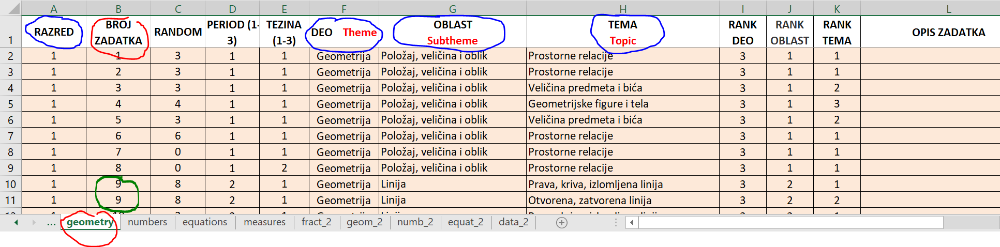
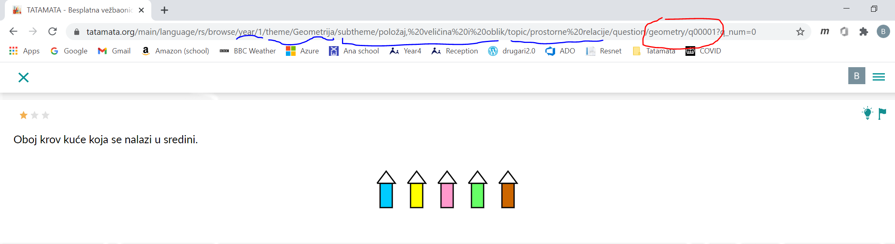
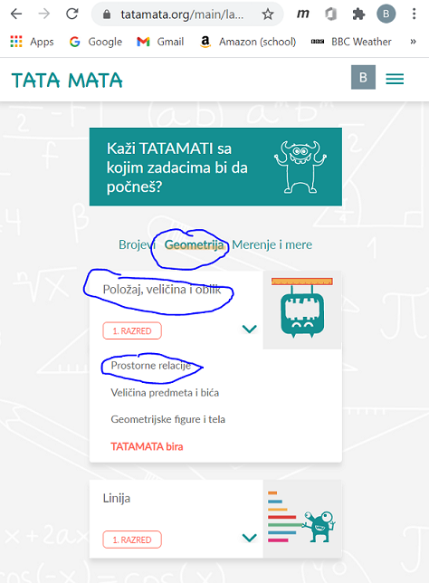

# Uputstvo za dodavanje sadržaja programskom paketu Shkola / Tatamata

U ovom dokumentu se nalaze instrukcije za korišćenje programskog paketa Shkola / Tatamata.

## Izmena i dopuna kategorizacije zadataka po nastavnom programu

Klasifikacija zadataka po uzrastu i oblastima se nalazi u Excel fajlu koji možete direktno preuzeti sa ove adrese: [https://github.com/bradunov/shkola/raw/master/lists/lists.rs.xlsx](https://github.com/bradunov/shkola/raw/master/lists/lists.rs.xlsx). Tabela izgleda ovako: 

U dnu se nalazi ime taba. U ovom slučaju to je Geometry. Unutar taba se nalazi lista zadataka. Naziv taba i broj zadatka ukazuju na šifru konkretnog zadatka u bazi zadataka. 

**Važna napomena**: polje za broj zadatka ne označava redni broj zadatka u tabeli, već jedinstvenu šifru zadatka. 

U konkrentom primeru sa slike, prvi zadatak ima broj 1. To znači da je šifra zadatka geometry/q00001 (na broj zadatka doda se broj 0 do 5 cifara i slovo q ispred). Ovaj konkretan zadatak u bazi zadataka se nalazi [ovde](https://github.com/bradunov/shkola/tree/master/questions/geometry/q00001). A evo kako izgleda njegova prezentacija na web sajtu:

Šifru ovog zadatka možete videti u polju za adresu vašeg pretraživača (na slici označeno crvenim). 
Svaki zadatak se može nalaziti u jednoj ili više stavki menija. 
Meni je podeljen na više kategorija i podkategorija. 
Na najvišem nivou je podeljen na *razrede* i zatim na *delove* (geometrija, brojevi, itd).
Svaki deo je podeljen u *oblasti* a svaka *oblast* u teme. 
U konkretnom primeru prvog zadatka *razred* je 1 (prvi), *deo* je *Geometrija*, *oblast* je *Položaj, veličina i oblik* a tema je *Prostorne relacije*.
Ove kategorije se takođe mogu videti u polju za adresu vašeg pretraživača (na slici označeno plavim).

Takođe je važno napomenuti da jedan zadatak može biti u više kategorija. 
To se može videti na primeru zadatka broj 9, označenog zelenom bojom na slici gore. 
Ovaj zadatak će se pojaviti i u temi *Prava, kriva, izlomljena linija* i u temi *Otvorena, zatvorena linija*.
Na sličan način se zadatak može ponoviti i u različitim oblastima, delovima i razredima.

Pored ovih osnovnih kategorije, Excel tabela sadrži još nekoliko polja koja su od interesa. 
Polje *random* označava koliko puta možemo pokazati zadatak korisniku pre nego što počne da se ponavlja. 
U slučaju prvog zadatka u geometriji vrednost je 3 zato što možemo konstruisati manji broj slučajnih varijanti ovog zadatka. 
U drugim slučajevima (npr sabiranja dva broja) ovde možemo staviti vrednost 10 (maksimalna vrednost, takođe označava da nema limita) zato što imamo skoro neograničenu kombinaciju brojeva za vežbanje.   

Kategorija *period* sugeriše deo školske godine u kome se taj zadatak uči. Ako učenik traži Tatamati da bira zadatke, Tatamata će prvo dati zadatke iz perioda 1, pa 2, pa onda 3. 
Kategorija *težina* označava koliko će se zvezdica pojaviti pored zadatka (1, 2 ili 3). 
Kategorije *rank deo*, *rank oblast* i *rank tema* označava redosled kojim će se te kategorije pojaviti u meniju. 

Na osnovu vrednosti osnovnih kategorija *deo*, *oblast* i *tema* u Excel tabeli (označenih plavom bojom), program smešta zadatak u odgovarajući meni. U ovom slučaju to je:

Tema *Prostorne relacije* ima rank 1 pa je prikazana pre teme *Veličina predmeta i bića* i *Geometrijske figure i tela*.
Oblast *Položaj, veličina i oblik* ima rank 1 pa je prikazana pre oblasti *Linija*.
Sličice koje se pojavljuju u meniju uz naziv oblasti su smeštene [ovde](https://github.com/bradunov/shkola/tree/master/src/images/themes). 
Veza između naziva oblasti i sličica je definisana [ovde](https://github.com/bradunov/shkola/blob/master/src/images/themes/icons.rs.json).

